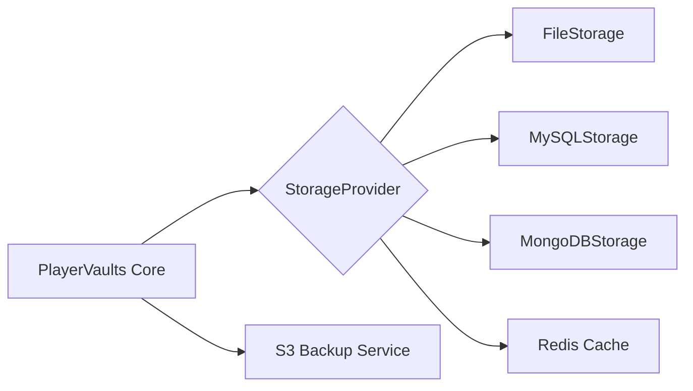

# PlayerVaultsX (Modern Edition)


[](https://github.com/westkevin12/PlayerVaultsX/actions/workflows/deploy.yml)
[](https://github.com/westkevin12/PlayerVaultsX)

> [!IMPORTANT] > **Complete Architectural Overhaul**
> This fork modernizes the original PlayerVaultsX for the 1.21+ era. It removes legacy technical debt (including `sun.misc.Unsafe`) in favor of high-performance, stable, and future-proofed Java 21 code.

## 🚀 Why this Fork?

This version is designed for **Large Networks** that require database-backed reliability.

### Key Technical Enhancements

- **Pluggable Storage Engine**: Uses a strict Strategy Pattern. Swap between high-speed FlatFile or Enterprise-grade **MySQL/MariaDB** via config.
- **Zero Legacy Bloat**: Entirely removed internal `sun.misc` dependencies that often cause crashes on modern JVMs.
- **Adventure UI**: Native support for MiniMessage and Adventure Components for beautiful, translatable GUIs.
- **Redis Caching**: Asynchronous Redis layer with Pub/Sub support for instant cross-server synchronization and high-performance caching.
- **Cloud Backups**: Built-in, zero-dependency S3 client for automated off-site backups to AWS, MinIO, or DigitalOcean Spaces.
- **Visual Selector GUI**: navigate vaults via a beautiful GUI with paginated pages and custom icons (`/pv ui` or `/pv selector`).
- **Interactive Search**: Instantly search all vaults for items via command (`/pv search <item>`) or use the **Interactive Anvil UI** in the selector.
- **Cross-Server Sync**: Redis Pub/Sub locking prevents data corruption and dupe exploits on BungeeCord/Velocity networks.
- **Advanced Serialization**: Utilizes **CardboardBox** for NBT-safe item serialization, ensuring items with complex metadata (custom enchants, attributes) are never lost during transfer.

## 🛠 Storage Strategy Architecture

The core logic is now decoupled from the storage layer. Developers can extend storage capabilities by implementing a single interface:



## 📥 Installation

1. **Requirement**: [Java 21+](https://adoptium.net/) is required.
2. Drop the `PlayerVaultsX.jar` into your `/plugins/` directory.
3. Configure your backend in `config.conf`.

### Database Configuration (Recommended for Networks)

To move away from legacy `.yml` storage, set your provider to `mysql`:

```hocon
storage {
  type = "mysql"
  host = "localhost"
  port = 3306
  database = "playervaults"
  username = "vault_admin"
  password = "secure_password"
}
```

## 🔄 Migration

Upgrading from a legacy version? Check out our [Migration Guide](MIGRATION.md) for instructions on moving your data to MySQL safely.

## ⌨️ Commands & Permissions

| Command          | Permission                | Purpose                             |
| ---------------- | ------------------------- | ----------------------------------- |
| `/pv <#>`        | `playervaults.amount.<#>` | Open a specific vault.              |
| `/pv <user> <#>` | `playervaults.admin`      | View/Edit another player's vault.   |
| `/pv <u...> -r`  | `playervaults.admin`      | **ReadOnly** Inspector Mode.        |
| `/pv ui`         | `playervaults.selector`   | Open the Visual Vault Selector GUI. |
| `/pv icon`       | `playervaults.icon`       | Set a custom icon for your vault.   |
| `/pv search`     | `playervaults.search`     | Search for items across all vaults. |
| `/pvdel <#>`     | `playervaults.delete`     | Wipe a vault's contents.            |
| `/pvconvert`     | `playervaults.convert`    | Migrate data (e.g., `EnderChest`).  |

## 🏗 Building

```bash
mvn clean install
```

## 📜 Credits

- **Original Author**: drtshock (Original PlayerVaults concept)
- **Modernization & Lead Developer**: [westkevin12](https://github.com/westkevin12)
